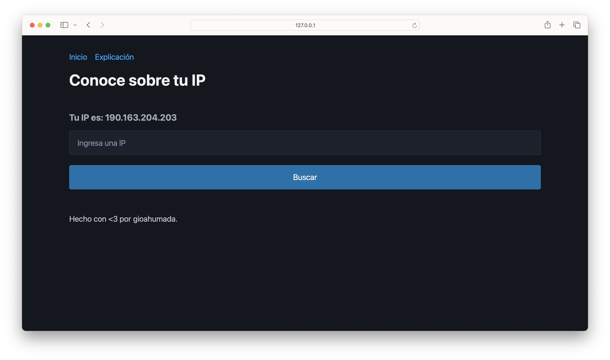

# IP Information 👨🏻‍💻

Este proyecto es una aplicación web que permite obtener información detallada sobre una dirección IP utilizando la API de [ipinfo.io](https://ipinfo.io).

## Capturas de Pantalla

## Características

- Obtener la IP pública del usuario.
- Buscar información detallada sobre cualquier dirección IP.
- Mostrar información como la ciudad, región, país, organización, y más.

## Tecnologías Utilizadas

- HTML
- CSS
- JavaScript
- API de ipinfo.io

## Uso

1. Abre el archivo `index.html` en tu navegador web.
2. La aplicación mostrará tu IP pública automáticamente.
3. Ingresa una dirección IP en el campo de búsqueda y haz clic en "Buscar" para obtener información detallada sobre esa IP.

## Configuración

Asegúrate de reemplazar el token en `app.js` con tu propio token de ipinfo.io.

